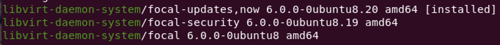

# **vm_backup.sh — Full‑Disk & Snapshot Backup Helper for Legacy libvirt**

> **Use‑case:** You run Ubuntu 20.04 LTS where the distro ships **libvirt 6.0.0** (the last version Canonical ever back‑ported). The modern *“push/pull backup API”* introduced in libvirt ≥ 7.2.0 is **not available**, so you need the older, proven *external‑snapshot + active block‑commit* workflow. That is exactly what this script automates — safely and idempotently.
>
> The following command confirms the available `libvirt` versions on Ubuntu 20.04, showing that 6.0.0 is the default:
>
> 
>
> *The method is endorsed (and still documented) in the upstream libvirt **Efficient live full disk backup** guide* <https://libvirt.org/kbase/full_backup.html>.

---

## Why not `virsh backup-begin`?

* `virDomainBackupBegin()` / `virsh backup-begin` first appeared in **libvirt 7.2**
  (Mar 2021) and requires **QEMU 4.2+**.  Ubuntu 20.04’s official repos provide
  libvirt 6.0 + QEMU 4.2 **only via the back‑ports PPA** — most long‑term systems
  stay on the GA stack for stability.
* Building a newer libvirt locally is possible but drags in a large dependency
  chain (glib2, system‑capabilities, etc.) and voids vendor support.

Hence the classic overlay → copy → block‑commit approach remains the most
portable and *supported* way to obtain **consistent full‑disk backups** on such
hosts.

---

## Features

| Capability | Notes |
|------------|-------|
| **External snapshot ("overlay")** | Uses `virsh snapshot-create-as` to freeze base qcow2 files; overlays are later block‑committed and deleted. |
| **Disk copy** | Copies every `<disk type='file' device='disk'>` (sparsely) to the backup dir. |
| **Optional qcow2 re‑compression** | `--compress` → `qemu-img convert -c`. |
| **Internal snapshot migration** | Dumps each internal snapshot XML, rewrites disk paths & UUID, stores in `$DEST/snapshots/`. |
| **Self‑contained restore XML** | Patched domain XML saved alongside disks — just `virsh define` to restore. |
| **Custom restore name** | `--new-vm-domain-name` overrides the default.
| **Crash‑safe cleanup** | Trap merges overlays & drops snapshot metadata on Ctrl‑C/abort. |
| **Rotation** | Keeps *N* most recent backups (default 6). |

---

## Prerequisites

```bash
virsh         # libvirt‑cli ≥ 1.2.9 (Ubuntu 20.04 ships 6.0)
xmlstarlet    # tiny XML editor
qemu-img      # only needed with --compress
```

> libvirt ≥ 1.2.9 supports **`blockcommit --active --pivot`** that this script
> relies on — see the [libvirt 1.2.9 release notes](https://libvirt.org/news.html).

---

## Quick Start

```bash
./vm_backup.sh \ 
  --backup-base-dir /srv/backups/libvirt \ 
  --vm-domain       ubuntu20 \ 
  --compress
  --new-vm-domain-name ubuntu20-backup1
```

Resulting tree:

```
/srv/backups/libvirt/ubuntu20/2025-07-14-215447/
├─ vda.qcow2
├─ vdb.qcow2
├─ ubuntu20-backup1.xml
└─ snapshots/
   ├─ snapshot1.xml
   └─ snapshot2.xml
```

Restore with:

```bash
virsh define ubuntu20-restore-*.xml
virsh start  ubuntu20-restore-…
for xml in snapshots/*.xml; do  # optional internal snaps
  virsh snapshot-create ubuntu20-restore-… --xmlfile "$xml" --redefine
done
```

---

## Command‑line Options

| Flag | Default | Description |
|------|---------|-------------|
| `--backup-base-dir DIR` | *(required)* | Directory that receives `/VM/TIMESTAMP/…`. |
| `--vm-domain NAME` | *(required)* | Domain to back up. |
| `--max-backups N` | `6` | Rotate; keep *N* newest. |
| `--compress` | off | Re‑compress each qcow2 (CPU‑heavy, slower). |
| `--new-vm-domain-name NAME` | `<vm>-restore-<timestamp>` | Name written into patched XML & snapshots. |

---

## Workflow (older‑libvirt method)

1. **Create external snapshot** — `virsh snapshot-create-as … --disk-only`
2. **Copy base qcow2 files** while guest writes go to overlays.
3. **(Optional) Compress** each copy with `qemu-img convert -c`.
4. **Dump & patch internal snapshots** (if any).
5. **Active block‑commit** — live‑merge overlay → base while VM is running.
6. **Cleanup** — delete snapshot metadata + overlay files.
7. **Dump & patch domain XML** with new name/uuid + new disk paths.
8. **Rotate** old backups.

See the upstream *Efficient live full disk backup* doc:  
<https://libvirt.org/kbase/full_backup.html>

---

## Cron Example (daily 03:00)

```cron
0 3 * * * /usr/local/bin/vm_backup.sh \
           --backup-base-dir /srv/backups/libvirt \
           --vm-domain ubuntu20              \
           --compress
```

---

## FAQ

* **Why does the script modify UUIDs?**  A defined domain must have a unique
  UUID; re‑using the original one would clash if the old VM is still known to
  libvirt.
* **Does it quiesce the filesystem?**  For best consistency install QEMU Guest
  Agent inside the VM _and_ add `--quiesce` to the external‑snapshot command —
  see the [libvirt snapshot docs](https://libvirt.org/formatdomain.html#elementsSnapshots).  You can wire this into the script if desired.
* **How big is the backup?**  Roughly the size of the original qcow2 images (a
  bit less with `--compress`).

---

Happy (legacy‑friendly) backing‑up!  
